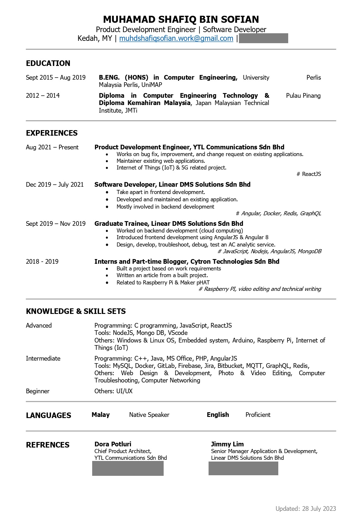

# My Resume in HTML & CSS
Hey yoo! This is a just a long weekend project to refresh my fundamentals of HTML & CSS.

My end **Goals** is to create my own portfolio web page. So, I take this as a kickstart to push me out to start the project.

> You'll never understand things until you get your hands dirty

### Version 1.0
1. Just follow my current resume transcode from PDF to HTML.
2. Simplfied and try to standardized using standard HTML tag.

   

